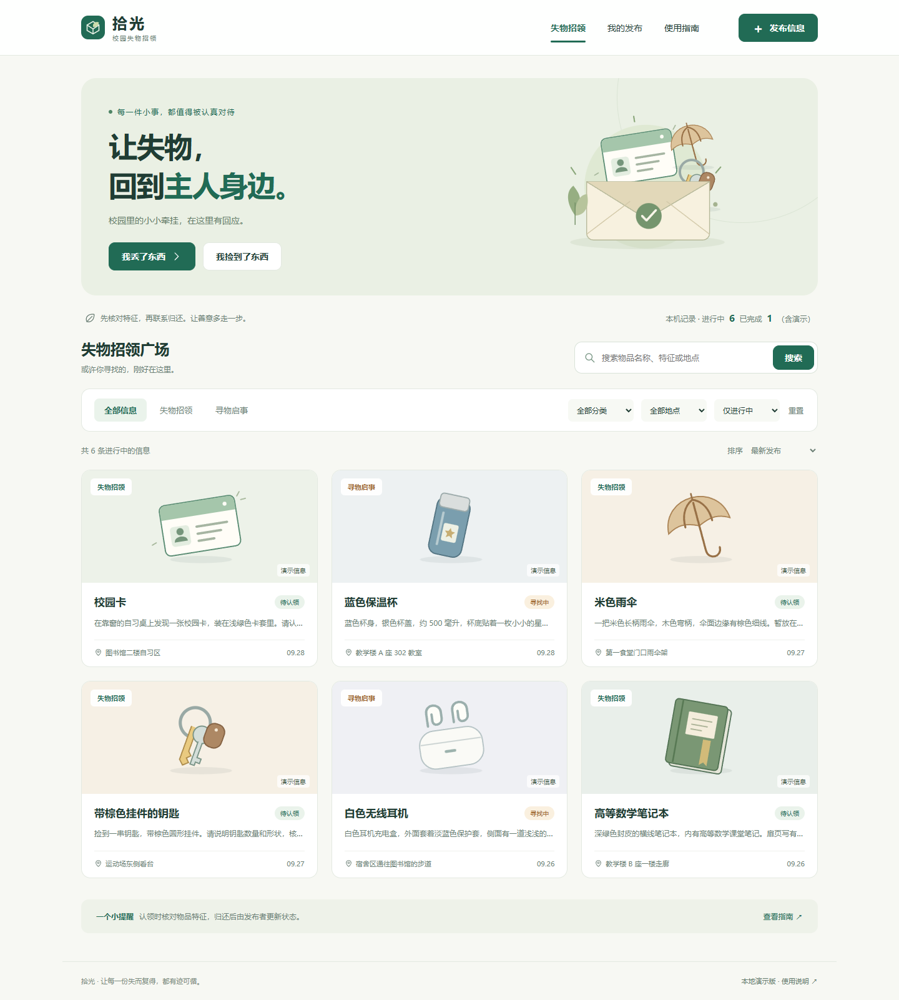

# 拾光 · 校园失物招领

杜玉鹤（162404109，[myp208116](https://github.com/myp208116)）与蔡信坡（162404103，[popochus](https://github.com/popochus)）的第二次结对作业实现材料。

延续第一次“拾光”的绿色、米白色原型，实现 **发布信息 → 浏览 / 搜索 → 查看详情 → 查看或复制联系方式 → 发布者更新状态**。



## 直接运行

1. 下载仓库 ZIP，**先完整解压**，保留目录结构。
2. 右键 `index.html` → 打开方式 → **Google Chrome**。
3. 首次打开可看到带“演示信息”标记的虚构样例。无需联网、Node.js、数据库或安装任何依赖。
4. 点击“发布信息”创建自己的记录；从“我的发布”或自己的详情页标记“已找到 / 已归还”。

网页使用普通脚本顺序加载，没有 CDN、远程字体、`fetch` 或模块跨域请求。`start.cmd` 也可尝试寻找常见安装位置的 Chrome；找不到时按上面的右键方式打开即可。

## 建议验收路径

| 操作 | 预期结果 |
| --- | --- |
| 搜索“校园卡”并点击结果 | 打开校园卡详情，地点和描述与卡片一致 |
| 查看联系方式 → 复制 | 提示已复制；受浏览器限制时保留可选中账号，提示手动复制 |
| 进入发布，空表直接提交 | 对缺失字段给出具体提示，不产生记录 |
| 发布自己的寻物信息 | 显示成功页，出现在广场和“我的发布”，状态为“寻找中” |
| “我的发布” → 标记已找到 → 暂不更新 | 状态保持不变 |
| 再次操作并确认 | 显示“已找到”，默认进行中列表隐藏它，全部状态能查到 |
| 发布招领后确认完成 | 对应状态为“待认领 → 已归还” |
| 刷新或关闭重开同一路径 | 已发布内容和完成状态仍保留 |
| 搜索不存在的关键词 / 组合筛选无匹配 | 显示空状态，可清空筛选或去发布 |
| 查看示例信息 | 能查看、联系；没有他人状态修改入口 |

## 功能与附加特点

- 寻物、招领统一数据模型，类型决定完成文案。
- 按名称、特征、具体地点、区域和分类搜索；空格分隔的多个关键词全部匹配，忽略英文大小写及全半角差异。
- 分类、地点、类型、状态可组合筛选；按发布时间或遗失 / 拾获日期排序。
- 联系方式支持微信、QQ、大陆手机号和邮箱；一键复制，失败可手动选择。
- 自动保存本机草稿；图片选填，支持 JPG、PNG、WebP，原图最多 5 MB，自动压缩后入库。
- 完成状态需确认；详情、广场、我的发布均从同一记录读取。
- 桌面与手机宽度适配，原生表单标签、键盘焦点、弹窗和状态提示。
- 存储写入失败不跳成功页；损坏数据不静默覆盖，可导出原始内容以便检查。

## 目录说明

```text
162404109-162404103/
├── index.html                   # 页面入口，直接用 Chrome 打开
├── start.cmd                    # Windows Chrome 启动辅助
├── README.md                    # 运行与验收说明
├── package.json                 # 仅测试需要 Node.js，运行网页不需要
├── css/style.css                # 绿色 / 米白主题与响应式样式
├── js/
│   ├── core.js                  # 校验、搜索、权限、状态等纯业务函数
│   ├── store.js                 # 带版本的本地记录与草稿存储
│   ├── seed.js                  # 7 条虚构示例，不含真实联系方式
│   └── app.js                   # 路由、DOM、表单、弹窗、图片与剪贴板
├── assets/                      # 10 个原创 SVG 图形，无外部图片依赖
├── tests/core.test.cjs           # 自动化白盒单元测试
├── scripts/
│   ├── build-assets.cjs          # 重建可编辑 SVG 素材
│   └── browser-test.cjs          # 隔离浏览器的操作回归与截图
└── docs/
    ├── 开发计划.md              # 开始编码前记录的范围和 PSP 预估
    ├── 设计说明.md              # 原型承接、模型与流程图
    ├── 测试说明.md              # 测试工具、教程、用例和评估
    ├── 测试报告.md              # 实际执行结果与局限
    ├── 结对与PSP.md             # 建议分工及待填写的个人真实记录
    ├── 博客_杜玉鹤.md           # 博客稿，含需本人补充的明确标记
    ├── 博客_蔡信坡.md           # 博客稿，含需本人补充的明确标记
    ├── 提交清单.md              # 仓库、fork、PR、博客、群表格
    ├── unit-test-output.txt     # 实际测试与覆盖率输出
    └── images/                  # 实机截图与流程图
```

## 数据与权限边界

本项目是可离线验收的前端实现。记录和草稿保存在 **当前浏览器** 的 `localStorage` 中，示例只用于演示。没有后端，因此**不提供不同同学、不同设备之间的实时数据共享或真实登录**。

初次运行生成本机标识；`ownerId` 决定“我的发布”和状态更新权限。此机制能够演示业务流程，不能抵抗开发者工具修改本地数据。正式校园部署需要服务端身份认证、鉴权、数据库以及数据保护策略。

不要用无痕窗口长期保存。移动 `index.html` 路径、换浏览器或清理站点数据可能影响原记录。不同 Chrome 版本对 `file://` 的存储行为可能有差异，请保持路径固定；详见 [MDN localStorage](https://developer.mozilla.org/en-US/docs/Web/API/Window/localStorage)。

## 单元测试

只运行网页不需要这些步骤。希望复跑测试时，安装 Node.js 22 或更新版本，在项目目录执行：

```sh
npm test
npm run test:coverage
```

使用 Node.js 自带的 `node:test` 与 `node:assert/strict`，没有测试框架安装依赖。报告、构造方法和覆盖范围见 [测试说明](docs/测试说明.md) 及 [测试报告](docs/测试报告.md)。测试文件随源码保留，题目允许“不必上传”，并不禁止上传。

浏览器操作回归是可选开发检查，额外需要 Playwright 和 Chrome，执行方式见测试说明。

## 作业与过程

- [课程主页](https://edu.cnblogs.com/campus/fzu/202601SofwareEngineering/)
- [本次作业题目](https://edu.cnblogs.com/campus/fzu/202601SofwareEngineering/homework/16744)
- [第一次墨刀原型](https://modao.cc/proto/lYgpHdtlyoamjXP1ive/sharing?view_mode=device&screen=rbpVWJJ5GAyNcXv3k&canvasId=rcVWJJ5GB7QSMTwy)

本次材料由助手根据用户提供的第一版原型辅助实现与验证。本地提交记录反映实际实现顺序，不代表两名同学已经完成 fork、PR 和互审。两人应阅读代码、复测并补齐真实协作记录、个人 PSP、博客链接及群表格；详见 [提交清单](docs/提交清单.md)。
