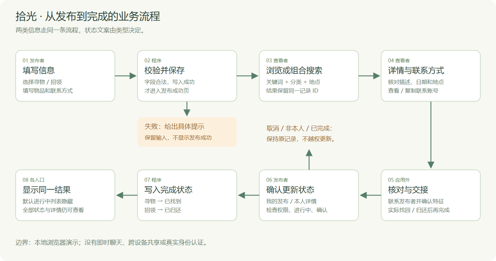
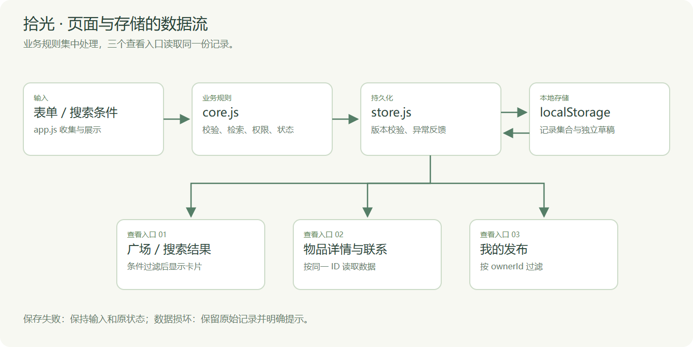
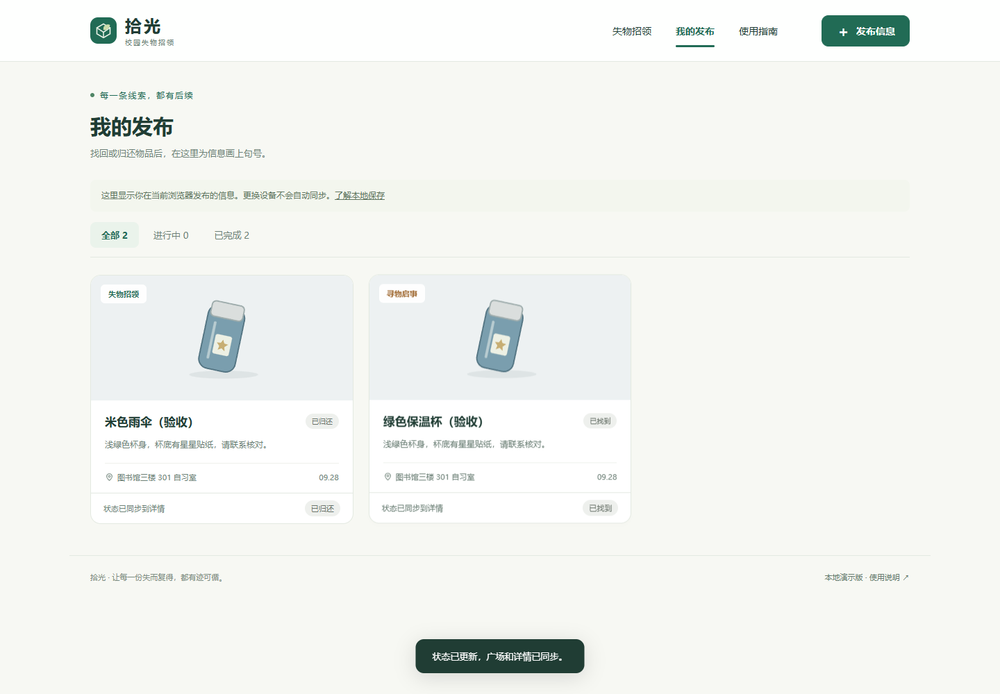
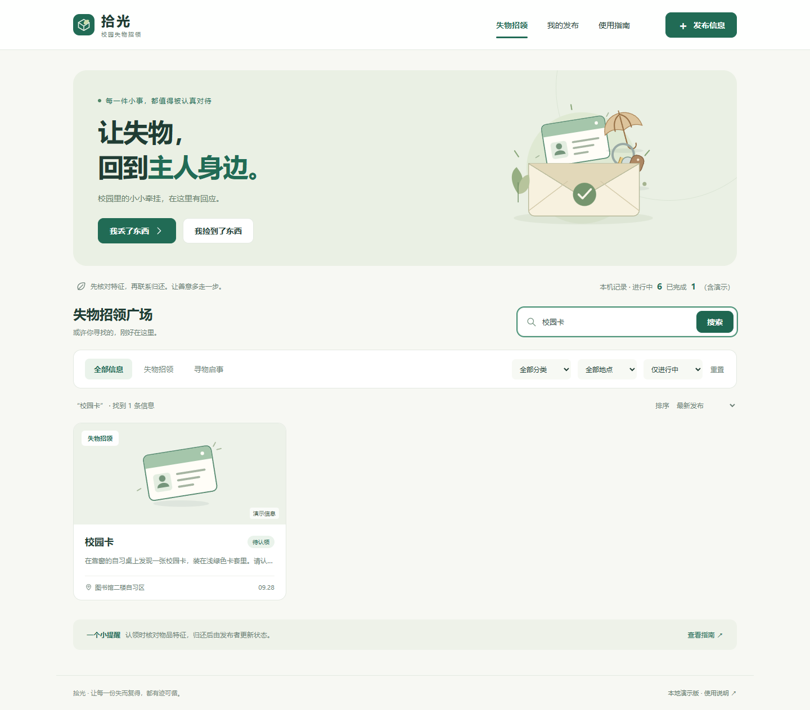
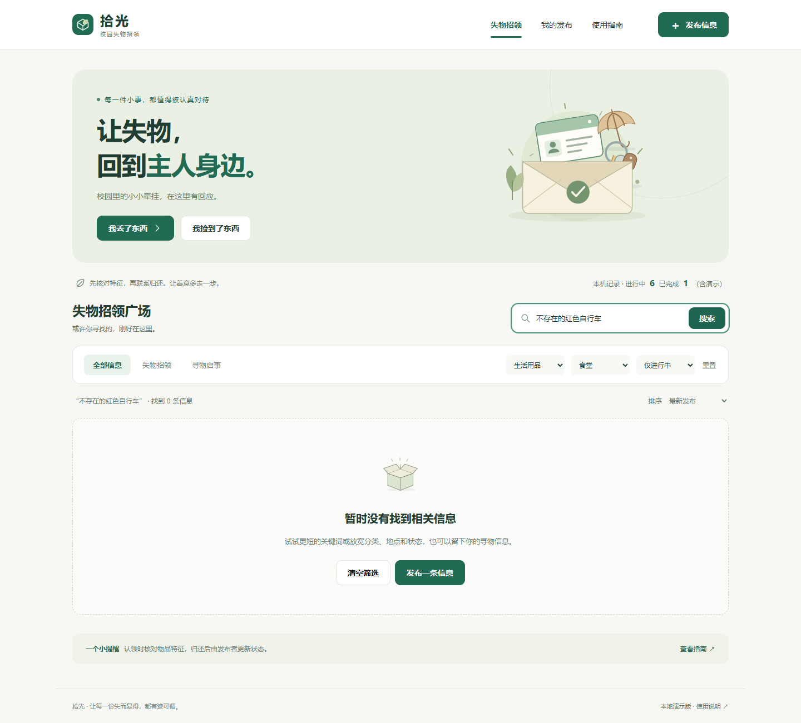
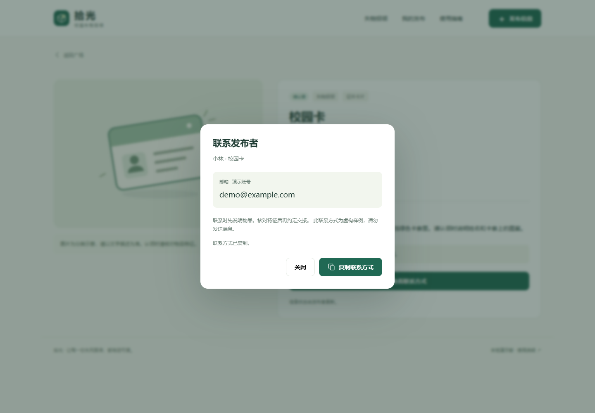
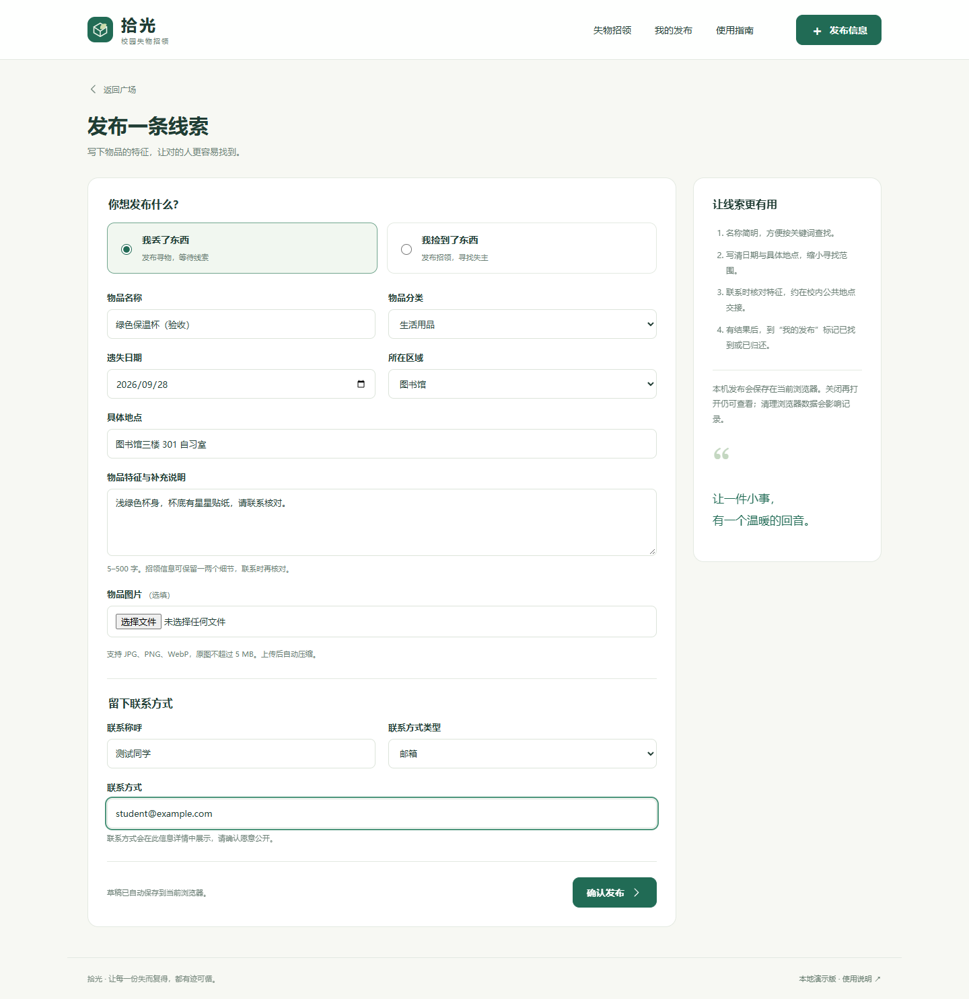
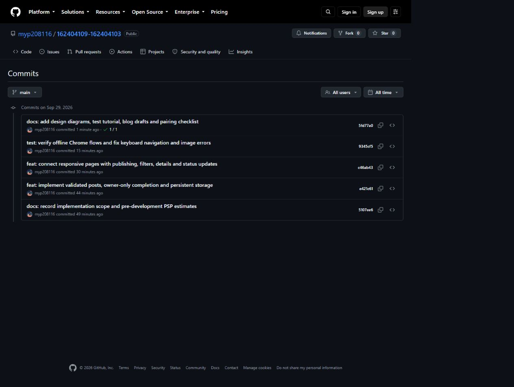

# 拾光：从八页原型到校园失物招领程序

| 项目 | 内容 |
| --- | --- |
| 姓名与学号 | 杜玉鹤 162404109 |
| 结对同学 | 蔡信坡 162404103 |
| 结对同学博客 | **待补：蔡信坡的博客园个人主页或本次文章链接** |
| 本篇博客发布链接 | **待发布后填写** |
| 课程主页 | [2026 软件工程](https://edu.cnblogs.com/campus/fzu/202601SofwareEngineering/) |
| 本次作业要求 | [第二次结对作业之程序实现](https://edu.cnblogs.com/campus/fzu/202601SofwareEngineering/homework/16744) |
| GitHub 项目 | [myp208116/162404109-162404103](https://github.com/myp208116/162404109-162404103) |
| 搭档 GitHub | [popochus](https://github.com/popochus) |

> 本次我使用 AI 辅助完成程序实现、自动化检查和材料整理。下文 PSP 采用可复核的会话实际时间；双方博客链接、搭档 fork / PR 和结对反馈在完成后补入。

## 一、承接第一次作业

第一次作业完成了“拾光”的八页墨刀原型，采用绿色与米白色，围绕首页、发布、搜索、详情、联系方式和我的发布组织流程。当时表单、搜索结果都是固定样例；本次我把它实现为可直接用 Chrome 打开的网页，补齐真实输入、数据保存和状态维护。

我将本次实现集中在这条流程：发布信息 → 浏览或搜索 → 查看详情 → 查看联系方式 → 在应用外核对和交接 → 发布者更新状态。状态修改入口同时位于“我的发布”和本人信息详情，确认后，广场、详情和个人列表读取同一条记录的新状态。

需求依据仍是题目给出的校园情境。没有做真实用户访谈，也没有测量寻物周期，因此不声称本程序已经把找回时间缩短到某个数值。


## 二、结对分工与 PSP

本轮我使用 AI 辅助完成程序与材料，提交到自己的主仓库。搭档的独立复测和 PR 单独记录。

| 成员 | 工作与安排 |
| --- | --- |
| 杜玉鹤 | 本轮完成发布、校验、存储、检索、状态管理和界面整合；执行自动化检查并整理文档 |
| 蔡信坡 | 后续在本人 fork 中复核搜索、详情、联系和手机布局，完成实际改进后提交 PR |
| 共同 | 后续交叉讲解代码、走查两类完整流程并复核博客 |

本表记录我使用 AI 辅助完成首轮实现的会话实际经过时间，含工具执行与等待。统计区间为 2026-09-29 19:21:32—20:19:01（UTC+8），起点取本次最早已记录的检查时间，阶段终点取真实 Git 提交时间；区间之前的准备、跨日等待及 9 月 30 日的后续材料修订不计入。未独立计时的子步骤合并列示，不再拆填分钟数。

| PSP 阶段 | 本次统计内容 | 预估（分钟） | 实际（分钟） |
| --- | --- | ---: | ---: |
| 计划、分析与设计（合并） | Estimate、Analysis、Design Spec、Design Review、Coding Standard、Design | 28 | 5.25 |
| Coding | 业务与存储、页面与交互实现 | 30 | 19.15 |
| Code Review + Test | 代码检查、Chrome 回归与修复 | 21 | 15.03 |
| Test Report | 测试说明、流程图与博客稿 | 15 | 13.57 |
| Size Measurement + Postmortem | 工作量核对、截图和交付材料整理 | 6 | 4.48 |
| 合计 | 合并阶段只计一次 | **100** | **57.48** |

预估沿用编码前保存的 100 分钟计划，实际统计为 57 分 29 秒，比预估少 42.52 分钟。已有原型和 AI 辅助生成缩短了设计、编码阶段；代码复审与测试用了 15.03 分钟，仍需给异常输入、坏图片、键盘导航和存储失败保留专门时间。这里记录会话经过时间，不把它换算成手工编码净工时。

详细起止时刻、秒数及提交编号见仓库 `docs/结对与PSP.md` 与 `docs/psp-evidence.json`。

## 三、实现思路

### 1. 模块拆分

页面使用 HTML、CSS 和原生 JavaScript，没有运行时第三方依赖。`core.js` 处理校验、搜索、权限和状态；`store.js` 包装本地存储；`seed.js` 提供虚构样例；`app.js` 处理页面、表单、图片及弹窗。把规则从 DOM 中分离，便于单元测试直接构造输入。

每条记录有唯一 ID、ownerId、类型、名称、分类、日期、区域、具体地点、描述、联系方式、可选图片、状态和时间戳。类型为 lost / found，状态为 active / done，界面分别显示“寻找中 / 已找到”或“待认领 / 已归还”。

### 2. 完整流程与数据流



校验失败时保留输入，提示具体字段；写入失败时继续留在表单，不跳成功页。搜索结果按记录 ID 进入详情，联系方式取自同一条记录。找回或交接完成后，由发布者确认更新，其他查看入口同步显示结果。



### 3. 有价值的代码：双层状态权限

```js
function canManage(post, ownerId) {
  return Boolean(post && !post.demo && ownerId && post.ownerId === ownerId);
}

function completePost(posts, id, ownerId, now = new Date()) {
  const post = posts.find(p => p.id === id);
  if (!post) return { ok: false, error: '这条信息不存在。' };
  if (!canManage(post, ownerId))
    return { ok: false, error: '只有发布者可以更新状态。' };
  if (post.status === 'done')
    return { ok: false, error: '这条信息已经完成，无需重复操作。' };
  return {
    ok: true,
    posts: posts.map(p => p.id === id
      ? { ...p, status: 'done', updatedAt: now.toISOString() } : p)
  };
}
```

本人才能看到状态按钮，业务函数还会再次检查权限，避免把“没有显示按钮”当作完整规则。函数返回新数组，界面等保存成功后再使用新数据，从而避免保存失败却显示完成。



本机 ownerId 仅用于演示发布者的操作边界，无法抵抗用户用开发者工具修改数据。没有后端的版本不提供真实身份认证或不同设备的数据共享，README 与界面指南均说明这一限制。

## 四、附加特点

### 1. 关键词、分类和地点组合筛选

只搜索“钥匙”可能得到较多记录，因此允许再限定物品分类和校园区域。搜索对名称、描述、地点等字段执行包含匹配，多个关键词用空格分隔，要求同时命中；英文大小写和全半角会统一。

```js
const tokens = norm(filters.keyword).split(/\s+/).filter(Boolean);
// 在类型、分类、区域、状态条件之外，进一步检查所有关键词。
tokens.every(t =>
  norm(`${p.title} ${p.description} ${p.location} ${p.area} ${p.category}`)
    .includes(t)
);
```

使用字符串匹配，不把用户关键词执行为正则表达式。没有结果时提供重置和发布入口。




### 2. 联系方式复制与失败回退

联系方式单独展示，减少误抄账号。优先调用 `navigator.clipboard.writeText`，权限拒绝时选中文字并尝试兼容复制；仍失败则明确提示手动复制，不显示虚假的“已复制”。

```js
try {
  await navigator.clipboard.writeText(input.value);
  copied = true;
} catch {
  input.focus();
  input.select();
  try { copied = document.execCommand('copy'); } catch { }
}
feedback.textContent = copied
  ? '联系方式已复制。'
  : '自动复制受限，请选中上方文字，按 Ctrl+C（Mac 用 ⌘C）复制。';
```



### 3. 草稿恢复与可选图片

表单变化时保存草稿，离开页面或刷新后可以继续。只有正式记录保存成功，才清除草稿。图片可选，支持 JPG、PNG、WebP，原图最多 5 MB，解码并压缩后保存；损坏图片有中文提示。



## 五、目录和运行方式

```text
index.html             网页入口
start.cmd              Windows Chrome 启动辅助
css/style.css          样式及响应式布局
js/core.js             业务规则
js/store.js            本地记录和草稿存储
js/seed.js             虚构样例
js/app.js              页面和交互
assets/                原创 SVG 素材
tests/core.test.cjs     单元测试
scripts/               素材生成及可选浏览器回归
docs/                  设计、PSP、测试报告、截图和博客稿
.github/workflows/     自动单元测试配置
README.md              完整说明
```

测试人员从 GitHub 下载 ZIP 后，先完整解压，再右键 `index.html`，选择 Google Chrome。无需启动服务器或安装 Node.js。首页可以先搜索“校园卡”，再自行发布一条寻物和一条招领，通过“我的发布”测试确认、取消和两类完成状态。测试自己的信息，不能修改标记为演示的记录。

默认只显示进行中信息，已完成记录可以从“全部状态”中查看。数据保存在当前浏览器，请保持文件路径固定；换设备或清理数据不会自动恢复原记录。

## 六、单元测试与回归

### 测试工具与简易教程

选用 Node.js 内置 `node:test` 和 `node:assert/strict`。按官方文档，从一个函数和一条断言开始，再覆盖成功、失败和边界分支。阅读 [Test runner](https://nodejs.org/api/test.html) 可了解测试的执行和报告；存储及剪贴板边界参考 [MDN localStorage](https://developer.mozilla.org/en-US/docs/Web/API/Window/localStorage) 和 [Clipboard.writeText](https://developer.mozilla.org/en-US/docs/Web/API/Clipboard/writeText)。

1. 安装 Node.js 22+，在项目目录确认 `node --version`。
2. 执行 `npm test`，无需安装测试依赖。
3. 观察用例名称以及 pass / fail。
4. 修改代码后重复运行；执行 `npm run test:coverage` 查看覆盖率。

我的测试方法是先把业务规则从界面中拆出来，再围绕一个函数准备合法输入，逐项改变边界条件。浏览器回归出现坏图片读取失败时，我先区分产品错误与测试数据错误，再保留损坏图片用例并换用有效 PNG 验证正常路径。

### 部分测试代码

```js
test('非发布者、空身份不可修改', () => {
  assert.equal(C.completePost([post()], 'post-a', 'owner-b').ok, false);
  assert.equal(C.canManage(post(), ''), false);
});

test('损坏 JSON 不覆盖原始记录', () => {
  const m = memory();
  m.setItem(S.KEY, '{invalid');
  assert.equal(S.load(m, [], 'a').ok, false);
  assert.equal(m.getItem(S.KEY), '{invalid');
});
```

`post()` 用固定日期和 ID 构造合法记录，`memory()` 是存储替身。这样能控制异常，不依赖真实浏览器里已有的数据。

### 数据构造与测试评价

按代码分支使用白盒方法，再补等价类和边界值：空白必填项、40 / 41 字名称、4 / 5 / 500 / 501 字描述、闰年和未来日期、四类联系方式、他人和示例记录权限、重复完成、空搜索和多词组合、HTML 字符、非法图片、损坏 JSON、容量耗尽等。

本次自动化执行结果为 **39 个单元用例全部通过**。业务与存储模块合计行覆盖率 **98.54%**、分支覆盖率 **90.97%**；这不是整个界面的覆盖率。另用 Google Chrome for Testing **154.0.8037.57**，在断网条件下直接打开 HTML，完成 **19 组浏览器回归**。桌面 1440×1000 与手机 390×844 均检查过；本次未捕获脚本异常和外部请求。

剪贴板自动化使用成功 / 拒绝两种替身，并未代替双方在各自电脑上的真实复制检查。尚未覆盖生产多人并发、真实认证和跨设备同步。两人独立复测结果应追加在报告中。

## 七、代码签入记录



[查看实时提交历史](https://github.com/myp208116/162404109-162404103/commits/main/)。按实际模块依次记录开发前计划、业务与存储、界面接通、浏览器测试和修复、文档补全。记录未回填日期，也没有冒用搭档身份。

**待补：** 蔡信坡实际 fork 地址、PR 链接、双方 review 结果。目前主仓库记录了本轮 AI 辅助实现，搭档的 fork / PR 完成后另行补充。

## 八、异常、尝试与解决

| 问题 | 尝试与处理 | 结果和收获 |
| --- | --- | --- |
| 类型枚举使用普通对象索引，有继承属性绕过可能 | 使用 Object.hasOwn，测试 __proto__、constructor 等输入 | 已通过回归，枚举判断应明确限定自身键 |
| “跳到主要内容”链接的 #main 与 hash 路由冲突 | 改为保留当前路由，只移动焦点；补键盘测试 | 已解决，辅助功能也需要走真实流程 |
| 损坏图片返回英文解码异常 | 转换为中文提示，并测试完整图片和损坏图片 | 已解决，应区分文件名合法和内容可解码 |
| 初版图片测试数据本身损坏 | 应用正确拒绝，重新生成有效测试 PNG，保留坏图测试 | 测试失败时也要检查测试前提 |

这些问题都有对应的代码改动或回归结果。后续结对复测时，我会继续记录双方实际发现的问题、尝试和结论。

## 九、个人总结与队友评价

这次实现让我看清了原型与程序之间还需要补齐的细节。原型中的“发布成功”只是一张页面，程序里则必须先确认字段合法、记录写入成功，再让用户看到结果；“已找到”也必须检查发布者身份，并同步到列表和详情。

我在本次开发中使用了 AI 辅助生成与检查代码，并保留提交和测试证据。下一步我会与蔡信坡围绕实际操作继续复测，优先检查联系方式复制、真实图片上传和关闭重开后的记录，再通过 fork 与 PR 完成互审。

**评价蔡信坡待本人填写：**

- 值得学习的地方：写一个真实的复测、代码解释、PR 或互审实例。
- 需要改进的地方：写一个具体协作问题及可执行改进方法。

队友评价在实际结对复测与 PR 互审后，结合具体实例填写。
