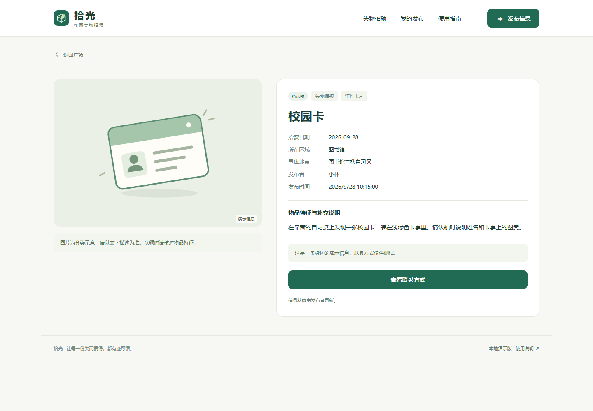

# 拾光：从搜索结果到物品归还，检查一条完整的使用流程

| 项目 | 内容 |
| --- | --- |
| 姓名与学号 | 蔡信坡 162404103 |
| 结对同学 | 杜玉鹤 162404109 |
| 课程主页 | [2026 软件工程](https://edu.cnblogs.com/campus/fzu/202601SofwareEngineering/) |
| 本次作业要求 | [第二次结对作业之程序实现](https://edu.cnblogs.com/campus/fzu/202601SofwareEngineering/homework/16744) |
| GitHub 项目 | [myp208116/162404109-162404103](https://github.com/myp208116/162404109-162404103) |
| 我的 GitHub | [popochus](https://github.com/popochus) |
| 搭档 GitHub | [myp208116](https://github.com/myp208116) |

## 一、从原型走到可以使用的程序

第一次作业中，“拾光”已经有首页、发布、搜索、详情、联系方式和“我的发布”等页面。本次实现继续使用绿色与米白色，也保留了原型中的主要操作入口。

我关注的重点是：用户输入自己的信息后，是否还能顺利走完原型里展示的流程。只输入“钥匙”可能出现多条结果，加上地点能否缩小范围？进入详情后，联系方式是否属于刚才那条信息？物品已经归还，列表是否还会继续把它显示为待认领？这些问题需要用同一份真实保存的数据串起来。

本次程序实现的流程是：**发布寻物或招领信息 → 浏览或搜索 → 查看详情 → 查看或复制联系方式 → 在应用外核对交接 → 发布者更新状态**。


当前版本使用浏览器本地存储，适合直接打开并验收功能。它没有真实登录和跨设备数据共享，样例记录也明确标注为演示信息。

## 二、分工与协作安排

本项目按业务实现和使用流程两个方向组织协作，分工如下。

| 成员 | 负责内容 | 对应检查重点 |
| --- | --- | --- |
| 杜玉鹤 | 需求与数据结构、发布校验、本地存储、发布者状态管理、主仓库与整体整合 | 信息能否正确保存，谁可以修改状态，保存失败时如何反馈 |
| 蔡信坡 | 搜索与分类地点筛选、详情和联系流程、空结果与手机布局、测试用例说明和验收文档 | 能否找到目标信息，详情是否对应同一记录，异常分支是否可继续操作 |
| 共同 | 确认字段和函数接口，交叉检查寻物与招领两条流程，复核截图、README 和博客 | 从输入到结束是否连贯，文档与程序是否一致 |

协作时，我侧重从使用者的操作顺序提出检查条件，杜玉鹤侧重梳理数据怎样保存和更新。例如，对“信息已经完成”这一情况，界面检查要明确默认列表是否隐藏、全部状态能否查到；业务检查要明确只有发布者能够操作，而且取消确认时必须保持原状态。

我们的协作安排是围绕同一条验收路径交叉检查：一人操作页面，另一人对照预期结果记录问题，再交换检查代码和提示文字。问题记录使用“输入、操作、预期、实际、相关函数”的格式，使后续修改能够定位到具体位置。实际 fork 和 PR 的状态在代码签入一节单独说明。

## 三、PSP 与时间分析

这里引用主仓库首轮 AI 辅助实现的项目 PSP，便于说明开发过程。现有记录没有单独计量我的复测与 PR 工作，因此这组实际时间归属主仓库首轮实现，不计作我的个人工时。

| PSP 阶段 | 本次统计内容 | 预估（分钟） | 实际（分钟） |
| --- | --- | ---: | ---: |
| 计划、分析与设计（合并） | Estimate、Analysis、Design Spec、Design Review、Coding Standard、Design | 28 | 5.25 |
| Coding | 业务与存储、页面与交互实现 | 30 | 19.15 |
| Code Review + Test | 代码检查、Chrome 回归与修复 | 21 | 15.03 |
| Test Report | 测试说明、流程图与博客稿 | 15 | 13.57 |
| Size Measurement + Postmortem | 工作量核对、截图和交付材料整理 | 6 | 4.48 |
| 合计 | 合并阶段只计一次 | **100** | **57.48** |

实际统计区间是 2026-09-29 19:21:32—20:19:01（UTC+8），共 57 分 29 秒，包含 AI 辅助、工具执行和等待。编码前保存的预估为 100 分钟；没有独立计时的子步骤合并列示，区间之前的准备、跨日等待和 9 月 30 日的材料修订不计入。检查点和提交编号见 [结对与 PSP 记录](结对与PSP.md)，秒数依据见 [psp-evidence.json](psp-evidence.json)。

已有原型和 AI 辅助缩短了设计与编码阶段。复审和测试仍用了 15.03 分钟，说明异常路径需要单独留出时间。下一次安排任务时，我会把正常发布、空搜索、权限检查、图片错误和存储失败分别列成检查项，再记录各项实际用时，减少只看总时长带来的误判。

## 四、设计与实现思路

### 1. 同一条记录贯穿整个流程

页面由 HTML、CSS 和原生 JavaScript 实现。`core.js` 处理校验、检索、权限和状态，`store.js` 管理本地保存，`app.js` 把业务结果显示到页面，`seed.js` 提供虚构样例。

一条信息有唯一 ID，以及发布者标识、寻物或招领类型、名称、分类、日期、区域、具体地点、描述、联系方式、图片和状态。搜索卡片按 ID 进入详情，联系弹窗读取该条记录的账号；“我的发布”按 `ownerId` 筛选。


寻物完成后显示“已找到”，招领完成后显示“已归还”。状态确认成功并保存后，列表、详情和个人页面读取相同的新状态；默认的进行中列表隐藏已完成记录，切换到全部状态仍可查看。


### 2. 搜索条件怎样组合

搜索允许同时填写关键词、分类、地点、类型和状态。多个关键词用空格分隔，要求每个词都命中；匹配范围包括物品名称、描述、具体地点、区域和分类。英文大小写及全半角会先统一。

下面是 `core.js` 中的检索函数，`norm` 是模块内的文本规范化函数。

```js
function queryPosts(posts, filters = {}) {
  const tokens = norm(filters.keyword).split(/\s+/).filter(Boolean);
  return posts.filter(p => (!filters.ownerId || p.ownerId === filters.ownerId)
    && (!filters.type || filters.type === 'all' || p.type === filters.type)
    && (!filters.status || filters.status === 'all' || p.status === filters.status)
    && (!filters.category || p.category === filters.category)
    && (!filters.area || p.area === filters.area)
    && tokens.every(t =>
      norm(`${p.title} ${p.description} ${p.location} ${p.area} ${p.category}`)
        .includes(t)))
    .sort((a, b) => filters.sort === 'event'
      ? b.eventDate.localeCompare(a.eventDate)
        || b.createdAt.localeCompare(a.createdAt)
      : b.createdAt.localeCompare(a.createdAt));
}
```

例如，输入“USB A楼”，记录中的名称包含 USB、地点包含 A楼即可匹配；输入“USB 食堂”，如果同一条记录中没有食堂，就不会命中。增加分类和区域条件时，这些条件也必须同时满足。空关键词只是不限制文字，其他筛选仍然有效。

我认为这里值得保留的设计是：函数只接收数据和条件，返回匹配结果，页面如何展示与筛选规则分开。`filter` 创建新数组后再排序，也不会打乱原始记录集合。


### 3. 无结果、联系和状态更新

无搜索结果时，页面提供清空筛选和发布入口，避免用户停在一个没有后续操作的空列表中。


联系功能支持微信、QQ、手机号和邮箱。复制优先使用浏览器剪贴板接口；自动复制失败时保留可选中文字，并提示手动复制。复制是否成功由操作结果决定。




状态按钮仅对本机发布者展示，业务函数仍再次检查 `ownerId`，并拒绝修改示例信息或重复完成。这里的本机标识只是演示操作边界，正式多人部署还需要服务端认证和鉴权。

### 4. 附加功能与界面

发布表单可以保存草稿，刷新后继续填写；正式记录保存成功才清除草稿。图片支持 JPG、PNG、WebP，原图不超过 5 MB，读取后压缩保存；损坏图片会给出中文提示。手机布局保持发布、搜索和联系入口可操作。


## 五、目录与运行说明

```text
index.html                 网页入口
start.cmd                  Windows Chrome 启动辅助
README.md                  运行方法与验收路径
css/style.css              界面样式与手机适配
js/core.js                 校验、搜索、权限和状态
js/store.js                本地记录与草稿存储
js/seed.js                 虚构样例数据
js/app.js                  页面、表单、图片与弹窗
assets/                    原创 SVG 素材
tests/core.test.cjs        单元测试
scripts/                   素材、流程图和浏览器检查工具
.github/workflows/         自动单元测试配置
docs/                      设计、PSP、报告、博客与截图
```

从 GitHub 下载 ZIP 并完整解压，用 Google Chrome 打开 `index.html` 即可。运行网页不需要服务器、网络或 Node.js。首次显示的样例可以查看和搜索，但不能修改状态。

我建议按下面的顺序验收：搜索“校园卡”并进入详情；查看和复制联系方式；发布自己的寻物信息；在“我的发布”中先取消状态更新，再确认完成；切换到全部状态检查结果。然后再发布一条招领信息，验证“待认领 → 已归还”。最后刷新页面，检查记录和状态是否保留。

数据保存在当前浏览器。更换设备、清理数据或移动文件路径可能影响记录，请保持同一路径进行复测。

## 六、单元测试的理解与结果

### 1. 从一个明确预期开始

我把单元测试理解为：给函数确定的输入，把正确结果写成断言，并让它能够重复执行。以搜索为例，“页面出现一张卡片”还不够具体；需要进一步说明是哪条记录、满足哪些条件、换一个条件后是否应当消失。

本项目使用 Node.js 内置的 `node:test` 和 `node:assert/strict`。阅读 [Node.js Test runner](https://nodejs.org/api/test.html) 可以了解测试组织、执行和报告。安装 Node.js 22 或更新版本后，在项目目录执行：

```sh
npm test
npm run test:coverage
```

这两个命令用于复跑测试，直接打开网页时无需安装 Node.js。理解一条测试时，我先对照被测函数找出条件，再检查输入数据只改变了哪个变量，最后看断言是否覆盖了该条件的成功与失败。

### 2. 搜索模块的部分测试代码

以下节选自实际测试文件，`post()` 是构造合法记录的辅助函数，`C` 是业务模块。

```js
test('20 多关键词采用 AND，大小写和全角兼容', () => {
  const a = [post({ title: 'USB 充电器', location: 'A楼' })];
  assert.equal(C.queryPosts(a, { keyword: 'ｕｓｂ A楼' }).length, 1);
  assert.equal(C.queryPosts(a, { keyword: 'USB 食堂' }).length, 0);
});

test('22 类型、分类、区域、状态组合筛选', () => {
  const a = [
    post(),
    post({ type: 'found', area: '食堂' }, 'owner-b', 'post-b')
  ];
  assert.equal(C.queryPosts(a, {
    type: 'found', category: '生活用品', area: '食堂', status: 'active'
  }).length, 1);
  assert.equal(C.queryPosts(a, {
    type: 'found', area: '图书馆'
  }).length, 0);
});
```

第一条同时检查规范化和多词 AND 关系；第二条检查组合条件，避免只实现关键词而遗漏区域等限制。两条都有命中与不命中的断言。

### 3. 测试数据怎样构造

我采用的分析顺序是先找合法输入，再改变一个条件，观察函数是否进入预期分支。

| 检查对象 | 数据与操作 | 预期 |
| --- | --- | --- |
| 必填字段 | 空串、只有空格、完整信息 | 不完整信息被拒绝，错误对应字段 |
| 字数与日期 | 名称 40 / 41 字，描述 4 / 5 / 500 / 501 字，闰日及未来日期 | 边界内通过，非法日期和越界输入被拒绝 |
| 搜索 | 空词、多词、英文大小写、全角字符、无匹配组合 | 规范化后一致，组合条件全部满足才显示 |
| 发布者权限 | 本人、他人、空身份、示例记录、重复完成 | 仅合法的本人进行中记录可以更新 |
| 本地保存 | 正常读回、损坏 JSON、容量不足 | 成功可恢复，失败保留原数据并提示 |
| 图片与文字 | 有效图片、坏图片、超大图片、HTML 字符 | 正常内容显示，非法内容被拒绝或转义 |

当前报告记录 **39 个单元用例全部通过**；业务与存储模块的行覆盖率为 **98.54%**，分支覆盖率为 **90.97%**。这些数值对应 `core.js` 和 `store.js`，界面完整性另由浏览器检查。

浏览器报告记录 Google Chrome for Testing **154.0.8037.57** 下的 **19 组离线检查通过**，包含桌面 1440×1000 与手机 390×844；该次检查未捕获脚本异常或外部网络请求。结果来自现有自动化报告。剪贴板成功和拒绝分支使用受控替身验证，各自电脑上的实际复制仍适合再手动检查。

## 七、异常处理与协作反思

项目记录中有几类值得复盘的问题。

| 问题 | 尝试与解决 | 我的理解 |
| --- | --- | --- |
| 类型枚举可能命中对象继承属性 | 改用 `Object.hasOwn`，增加 `__proto__`、`constructor` 等输入检查 | 允许的值应当明确限定 |
| 跳到主要内容的链接干扰页面路由 | 保留当前路由，只移动焦点，补键盘检查 | 鼠标正常不代表键盘路径也正常 |
| 损坏图片返回难理解的读取异常 | 转成中文提示，同时验证正常和损坏图片 | 文件扩展名和内容可解码是两项检查 |
| 测试中的正常 PNG 本身损坏 | 更换有效测试图片，保留坏图片用例 | 测试失败也要核对测试数据的前提 |

这些问题已有对应修改与回归记录。对我而言，最有用的经验是把“为什么失败”拆开判断：先检查测试输入，再检查业务规则，最后检查页面如何显示结果。这样能减少把数据问题误判成程序问题的情况。

按照上述分工，搜索、详情、联系与状态管理由不同侧重点衔接，协作需要提前约定字段名、状态含义和错误返回方式。下一次我会先把这些接口和验收条件写在一起，再补正常、取消和失败三类操作，减少页面接通后才发现理解不同的返工。

## 八、GitHub 签入记录


[主仓库提交历史](https://github.com/myp208116/162404109-162404103/commits/main/) 记录了计划、业务与存储、页面接通、浏览器检查与修复、文档补全等阶段。截图保留拍摄时的记录，后续文档提交以实时历史为准。

截至 2026 年 9 月 30 日本次核对，主仓库已建立，程序与材料已提交；尚未查到我的同名 fork，主仓库的 PR 列表为空。我将使用 `popochus` 完成 fork，在独立复测和实际改进后提交 PR，再由杜玉鹤检查修改与验证结果。这部分协作尚未完成。

## 九、个人总结与评价杜玉鹤

从这份程序和测试材料中，我最关注的是一个功能怎样被检查清楚。搜索结果要能够解释为什么出现，完成状态要在各入口保持一致，复制失败要让用户知道下一步怎么做。把预期写具体，才容易判断修改有没有解决问题。

我也认识到，自动化用例与手动体验各有作用。业务函数适合构造边界数据反复验证；页面阅读顺序、手机操作以及真实剪贴板，则需要按实际使用路径检查。后续我会继续练习把一次手动发现的问题转成可重复执行的测试。

**值得学习的地方：** 我比较认可杜玉鹤从数据和规则出发整理功能的思路。发布前的字段校验、保存失败后的反馈，以及完成状态的权限检查，都对应到明确的业务规则。按照这样的结构阅读代码，能够较快找到问题应该在哪个模块处理，也方便我从搜索和详情一侧检查结果是否一致。

**需要改进的地方：** 我希望杜玉鹤在模块交接时更早说明字段、返回结果和异常处理约定。例如，哪些情况返回错误、哪些情况保留原数据，如果能在接页面之前写清楚，双方检查时就更容易使用同一套预期。后续可以在每个功能开始前列一份简短接口说明，完成后再共同核对正常、取消和失败三条路径。
