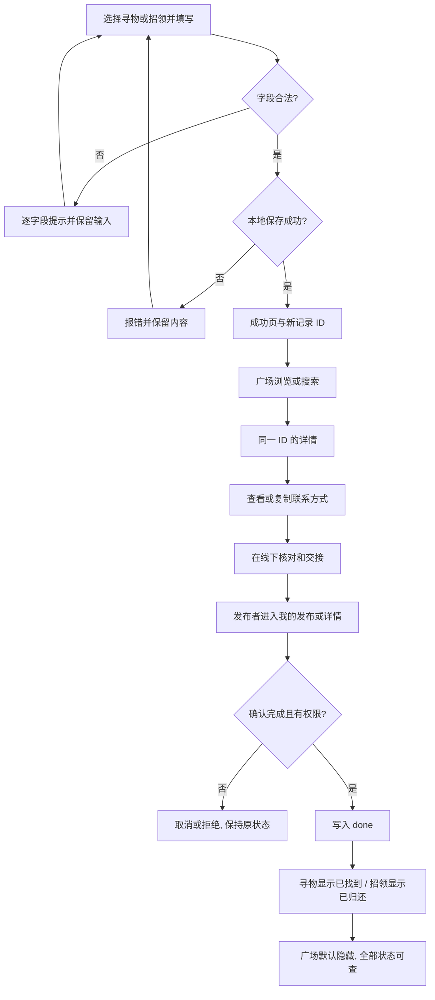
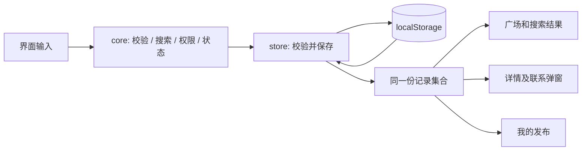

# 从第一次原型到可运行程序

## 原型承接

第一次原型采用绿色与米白色、卡片列表及独立联系弹窗，已有八页固定样例。第二次选择 PC Web，并兼顾窄屏，保留原来的信息层次，将预设页面替换为真实数据驱动的操作。

| 第一次原型 | 第二次实现 |
| --- | --- |
| 首页的固定卡片 | 从记录集合生成卡片，类型、状态和筛选可切换 |
| 发布寻物的预填图片 | 可输入表单，两类发布均可用，逐字段校验 |
| 固定发布成功页 | 仅在写入存储成功后显示，链接到刚创建的记录 |
| 搜索 / 校园卡结果 | 任意关键词搜索，与分类、地点、状态组合 |
| 校园卡详情 | 按唯一 ID 查找同一条记录，无效链接有提示 |
| 联系方式页 | 原生 dialog 弹窗，可复制，有失败回退 |
| 我的发布展示 | 按本机 ownerId 过滤，可确认完成 |

第一次的需求依据是作业场景，仍没有真实用户访谈或找回时间统计。本次不作“显著缩短寻物周期”等未经测量的效果承诺。

## 模块与数据

`core.js` 负责不依赖 DOM 的规则；`store.js` 包装存储；`seed.js` 提供明确标记的虚构样例；`app.js` 负责表单、路由、渲染和交互。普通 script 按依赖顺序加载，避免本地直接打开文件时的模块 / fetch 限制。

记录字段如下：

| 字段 | 作用 |
| --- | --- |
| id / ownerId | 记录唯一标识 / 本机发布者标识 |
| type | lost 寻物，found 招领 |
| title / category | 物品名称与分类 |
| area / location / eventDate | 校园区域、具体地点、遗失或拾获日期 |
| description / photo | 特征文字与可选压缩图片 |
| nickname / contactType / contact | 联系称呼、类型及账号 |
| status | active 或 done |
| createdAt / updatedAt | ISO 格式的创建和更新时间 |
| demo | 是否为虚构示例；示例不可由用户完成 |

存储外层为 `{ version: 1, ownerId, posts }`。草稿使用独立键，发布失败不清除，发布成功后清除。数据读入先检查版本、字段、状态及 ID 唯一性；数据不合法时保留原值并显示错误，不自动重置。

## 核心流程图




这里的“联系”是展示对方提供的联系方式，交接在应用外完成，没有实现即时聊天，也不会自动向示例账号发送消息。




## 关键实现

### 权限和状态

```js
function canManage(post, ownerId) {
  return Boolean(post && !post.demo && ownerId && post.ownerId === ownerId);
}
```

界面仅为本人记录显示按钮，业务函数再检查 ID 是否存在、身份是否匹配、状态是否仍为 active。确认弹窗只是交互提醒，不能代替业务检查。

```js
const next = { ...state, posts: result.posts };
const saved = S.save(storage, next);
if (!saved.ok) { toast(saved.error); return; }
state = next;
closeModal();
render();
```

先保存再替换界面状态，防止存储失败时显示“已完成”。`completePost` 返回新数组，避免在失败之前修改旧状态。两个类型都只有 active → done 这一条转换，完成后没有重复完成入口。

### 搜索和附加筛选

关键词先规范化全半角并转小写，按空格拆词。每条记录先经过类型、状态、分类和区域条件，再对名称、描述、地点等字段做全部关键词匹配。此实现是本地字符串检索，没有把关键词当作正则表达式，特殊符号不会成为代码。

### 文本与图片

所有用户字符串进入 HTML 时通过 `escapeHTML`。图片仅接受受限长度的 JPEG、PNG、WebP data URL，不允许 HTML、SVG 或远程脚本地址。上传原图先由浏览器解码，再按最长边 900 px 等比压缩为 JPEG，避免直接把多 MB 图片塞进本地存储。

### 附加特点的意义

1. **分类 + 地点组合筛选**：同名“钥匙”较多时，可以缩小到图书馆、食堂等范围；没有位置坐标，也不假装计算距离。
2. **联系方式复制及回退**：减少手工抄写账号出错；Clipboard API 拒绝时尝试兼容复制，再提供手动选择。
3. **草稿恢复与可选图片**：减少填到一半离开后的重复输入，图片帮助核对；草稿仍受本机存储边界限制。

## 边界

- 本地单浏览器存储，不是多用户共享的线上平台。
- 本机身份不是真实认证，不能抵抗直接修改 localStorage；正式发布要加服务端鉴权。
- 多标签页修改前重新读取数据，并响应 storage 事件，但不提供数据库级事务，极端并发写入可能互相覆盖。
- 不实现地图、聊天、实名认证、收藏、消息系统和复杂后台。
